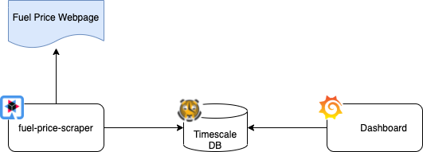

# Fuel-Price-Tracking

This repository aims to keep track of fuel prices in my local area. To accomplish this task, the repository offers three
key components. First, a [web scraper](./fuel-price-scraper/RADME.md) that loads the current fuel prices from local gas 
stations. Next, a [Timescale DB](./fuel-price-database/RADME.md) that stores scraped fuel price data over time. Last but
not least, a [Grafana dashboard](./fuel-price-dashboard/RADME.md) helps to visualize the price change over time.

## Web Scraper
The web scraper is supposed to get the current fuel price for one or multiple gas stations. To further process and store
this information, the scraper stores the scraped and converted data into a time-series database (e.g. Timescale DB).

## Timescale Database
Since the underlying database is optimized for time-series, the stored data can be used without huge efforts. 
Furthermore, a database that is optimized for time-series data will scale much better in the future.

## Grafana Dashboard
To load and visualize the data within a Grafana dashboard, the following instructions might be helpful 
(https://docs.timescale.com/timescaledb/latest/tutorials/grafana/).