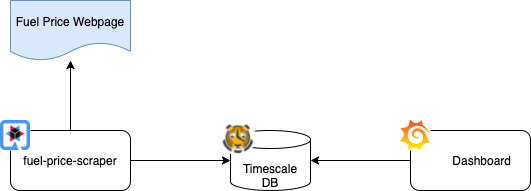

# Fuel-Price-Tracking

This repository aims to keep track of fuel prices in my local area. To accomplish this task, the repository offers three
key components. First, a [web scraper](./fuel-price-scraper/RADME.md) that loads the current fuel prices from local gas 
stations. Next, a [Timescale DB](./fuel-price-database/RADME.md) that stores scraped fuel price data over time. Last but
not least, a [Grafana dashboard](./fuel-price-dashboard/RADME.md) helps to visualize the price change over time.

## Web Scraper

## Timescale Database

## Grafana Dashboard