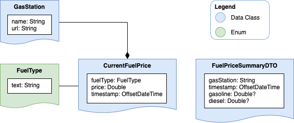

# fuel-price-scraper

The Quarkus service `fuel-price-scraper` offers functionality for scraping the fuel price from an existing website for
a given nearby gas station. Moreover, the service converts the scraped data into a well formatted JSON document that is
then supposed to be stored into a database for further usage.

## Object Model

